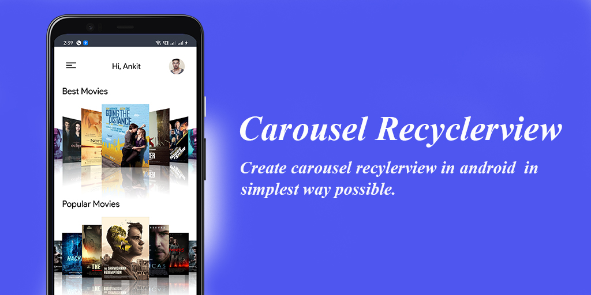

<h1 align="center"> carousel Recyclerview </h1>

Carsouel Recyclerview: Create carsoule effect with powerfull recyclerview in your application

 

  
  
    

 

Property infinite and 3D Item enabled |Property infinite and alpha Item enabled |
| :---------------: | :---------------: | 
|  |  |
 
